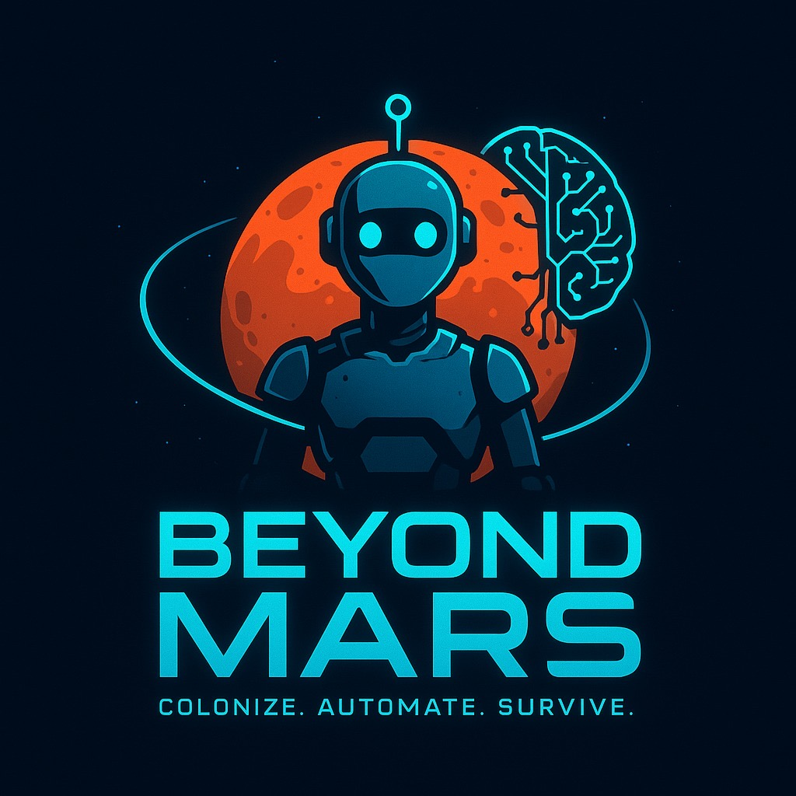

# Projeto 2 - Beyond Mars
## FECAP - Fundação de Comércio Álvares Penteado

  

## Nome do Projeto: Beyond Mars  

## Nome do grupo: ByteBrothers

## Integrantes do Grupo
[Ana Clara Keiko Ribeiro Hagiwara da Silva](https://www.linkedin.com/in/ana-clara-keiko-ribeiro-da-silva-970063341)  
[Gabriel Vazquez Mamede Diniz](www.linkedin.com/in/gabriel-diniz-b4a233345)  
[Luiz Miguel de Toledo](https://www.linkedin.com/in/luiz-miguel-de-toledo-b35701351/)  

## Professores Orientadores
[Adriano Felix Valente](https://www.linkedin.com/in/adriano-valente-534576135/)  
[Joyce Daniele Tavares](https://www.linkedin.com/in/)  
[Luis Fernando dos Santos Pires](https://www.linkedin.com/in/luisspires)   
[David de Oliveira Lemes](https://www.linkedin.com/in/dolemes/)  
[Renata Muniz do Nascimento](https://www.linkedin.com/in/remuniz/)  
[Victor Bruno Alexander Rosetti de Quiroz](https://www.linkedin.com/in/victorbarq/)  

# Descrição

  

 

## 🎮 Narrativa do Jogo
  Em um futuro sombrio, a Terra está com os dias contados após a descoberta de um meteoro colossal em rota de colisão.  
A humanidade precisa se adaptar rapidamente para sobreviver, buscando abrigo em marte.  
No comando de uma missão interplanetária, o jogador será responsável por colonizar, gerenciar recursos, fazer trocas e enfrentar eventos imprevisíveis para salvar a civilização.

- <ins>Referências</ins>: No Man's Sky, Empyrion Galactic Survival e Minecraft. 

## 🎥 Trailer do Jogo
Acesse o link: https://www.youtube.com/watch?v=6ekx4BGPgkw

## 🗂 Estrutura de Pastas
|-->src  
  &emsp;|-->Jogo  
    &emsp;&emsp;|-->Entrega 1  
    &emsp;&emsp;&emsp;|-->Scripts
    &emsp;&emsp;|-->Entrega 2
    &emsp;&emsp;&emsp;|-->Scripts
|-->documentos  
    &emsp;&emsp;|-->Entrega 1  
       &emsp;&emsp;&emsp;|-->Algoritmos e Lógica da Programação  
       &emsp;&emsp;&emsp;|-->Cálculo I  
       &emsp;&emsp;&emsp;|-->Jogos Digitais e Sistemas Digitais Interativos  
       &emsp;&emsp;&emsp;|-->Projeto Interdisciplinar Jogos Digitais  
       &emsp;&emsp;&emsp;|-->Ética e Pensamento Computacional  
    &emsp;&emsp;|-->Entrega 2  
       &emsp;&emsp;&emsp;|-->Algoritmos e Lógica da Programação  
       &emsp;&emsp;&emsp;|-->Cálculo I  
       &emsp;&emsp;&emsp;|-->Jogos Digitais e Sistemas Digitais Interativos  
       &emsp;&emsp;&emsp;|-->Projeto Interdisciplinar Jogos Digitais  
       &emsp;&emsp;&emsp;|-->Ética e Pensamento Computacional  
|-->executável  
&emsp;&emsp;&emsp;|-->Entrega 2

|README.md

## 🚀 Instalação
Instalação feita a partir do itch io com o link:
https://gdiniz12.itch.io/beyond-mars

## 📋 Licença
<a href="https://www.fecap.br/">FECAP - Fundação de Comércio Álvares Penteado</a>    
<a href="https://github.com/2025-1-MCC1/Projeto2">Beyond Mars</a> © 2025 by <a href="https://github.com/AnaClaraKeiko">Ana Clara Keiko Ribeiro Hagiwara da Silva</a>, <a href="https://github.com/GDiniz12">Gabriel Vazquez Mamede Diniz</a>, <a href="https://github.com/toledomiguel">Luiz Miguel de Toledo</a> is licensed under <a href="https://creativecommons.org/licenses/by-sa/4.0/">CC BY-SA 4.0</a> 

## 🎓 Referências
[VidnozIA](https://pt.vidnoz.com/)  
[Creative Commons](https://creativecommons.org/share-your-work/)  
[Template PI FECAP](https://github.com/fecaphub/Template_PI)  
[Pexels](https://www.pexels.com/pt-br/)  
[ChatGPT](https://openai.com/index/chatgpt/)  
