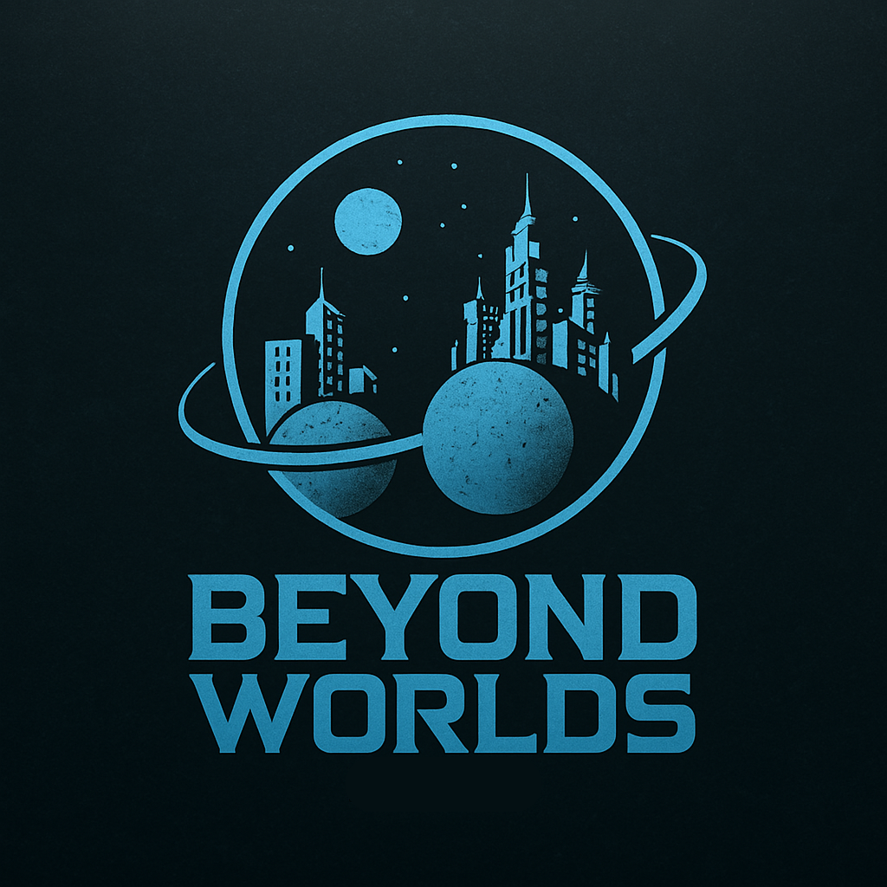

# FECAP - Fundação de Comércio Álvares Penteado

# Beyond Worlds

  

## Grupo: Byte Brothers

## Integrantes:
- Ana Clara Keiko Ribeiro Hagiwara da Silva  
- Gabriel Vazquez Mamede Diniz  
- Luiz Miguel de Toledo

## Professores Orientadores:
- Adriano Felix Valente  
- Joyce Daniele Tavares  
- Luis Fernando dos Santos Pires  
- David de Oliveira Lemes  
- Renata Muniz do Nascimento  
- Victor Bruno Alexander Rosetti de Quiroz  

## Descrição

Em um futuro sombrio, a Terra está com os dias contados após a descoberta de um meteoro colossal em rota de colisão.  
A humanidade precisa se adaptar rapidamente para sobreviver, buscando abrigo em dois planetas extremos: Earthrise (quente) e Tundrion (gelado).  
No comando de uma missão interplanetária, o jogador será responsável por colonizar, gerenciar recursos, fazer trocas e enfrentar eventos imprevisíveis para salvar a civilização.

O jogo une estratégia, gerenciamento e sobrevivência, com inspiração em títulos como *Minecraft*, *Cities: Skylines* e *No Man's Sky*.

---
